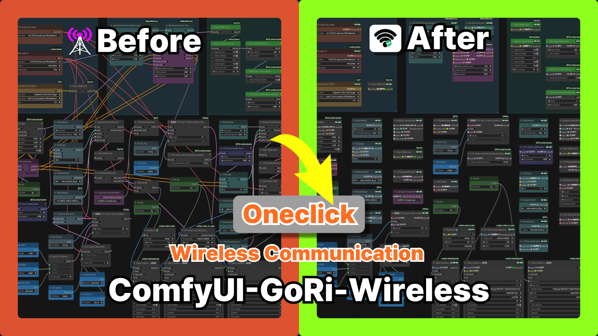

# 📡 ComfyUI-GoRi-Wireless Engine

> [!IMPORTANT]
> **GoRi Engine is currently Windows-only.** > Use on other operating systems (macOS, Linux) is not supported.

---

## 🚀 One-Click Workflow Revolution
복잡한 워크플로우의 선(Wires) 때문에 머리 아프셨나요?  
**GoRi-Wireless Engine**은 단 한 번의 클릭으로 지저분한 선들을 정리하고 최적화된 로직을 제공합니다.

### ✨ Key Features
* **One-Click Optimization:** 복잡한 노드 연결을 깔끔하게 정리 (Shift+S).
* **Wireless Experience:** 선이 없어도 강력하게 연결되는 고유의 로직 엔진.
* **Performance Focused:** 윈도우 환경에 최적화된 빠른 반응 속도.

---

## 🛠️ Installation
1. Open **ComfyUI Manager**.
2. Click **"Install via Git URL"**.
3. 현재 이 페이지의 URL을 복사해서 붙여넣으세요.
4. Restart ComfyUI.

## 📖 Guides & License
* [English Guide](./GoRi_Engine_Guide_EN.md)
* [한국어 가이드](./GoRi_Engine_Guide_KO.md)
* [License (KO)](./GoRi%20엔진%20라이선스.txt)
